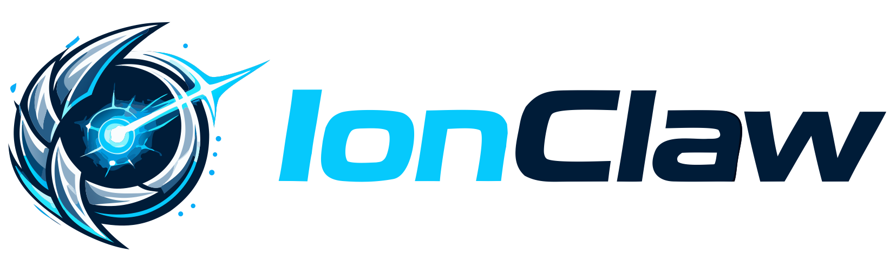

# Homebrew Tap — IonClaw

<p align="center">
    <a href="https://github.com/ionclaw-org/ionclaw" target="_blank" rel="noopener noreferrer">
        
    </a>
</p>

<p align="center">
    <a href="https://opensource.org/licenses/MIT"></a>
</p>

<p align="center">
    Official <a href="https://brew.sh/">Homebrew</a> tap for installing <a href="https://github.com/ionclaw-org/ionclaw">IonClaw</a> on macOS.
</p>

---

## Install

Add the tap and install:

```bash
brew tap ionclaw-org/tap
brew install ionclaw
```

## Install a Specific Version

To install from a specific tag:

```bash
brew install ionclaw@1.0.3
```

## Install from HEAD

To install the latest code from the `main` branch:

```bash
brew install --HEAD ionclaw
```

## Upgrade

```bash
brew upgrade ionclaw
```

For HEAD installations:

```bash
brew upgrade --fetch-HEAD ionclaw
```

## Uninstall

```bash
brew uninstall ionclaw
brew untap ionclaw-org/tap
```

## Usage

After installation, initialize and start a project:

```bash
ionclaw-server init /path/to/your/project
ionclaw-server start --project /path/to/your/project
```

Open `http://localhost:8080` in your browser. The web panel is served automatically.

## What is IonClaw?

IonClaw is a C++ AI agent orchestrator that runs anywhere as a native build — Linux, macOS, Windows, iOS, and Android — with zero external dependencies.

For more information, see the [main repository](https://github.com/ionclaw-org/ionclaw).

## License

MIT — see [LICENSE](LICENSE.md) for details.

## Links

- [IonClaw](https://github.com/ionclaw-org/ionclaw) · [Issues](https://github.com/ionclaw-org/ionclaw/issues) · [Discussions](https://github.com/ionclaw-org/ionclaw/discussions)
